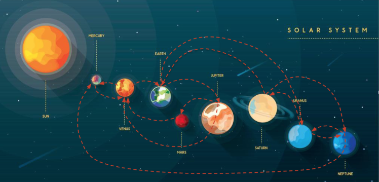
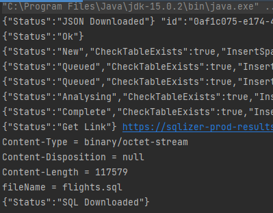

#COSMOS ODYSSEY

Assignment: https://smallpdf.com/result#r=106d0db12b1fdcb0e563bafc6b42d56d&t=share-document



Deployed: http://cosmos-env1.eba-d4k5v2eu.us-east-2.elasticbeanstalk.com/


## How to use
```
1. gh repo clone Nurech/uptime
2. opn cmd and cd into project root, do "mvn clean install" (make sure to have Maven installed first)
3. Maven will do all the work, builds the front and the back
4. In project root do "java -jar backend/target/backend-1.0.0-SNAPSHOT.jar", to run backend server (keep server running)
5. Open new cmd and cd into uptime/frontend and do "npm run serve" to run frontend
6. Go to: http://localhost:5000/
```

### project structure
```
uptime (Maven project)
├─┬ backend (Spring Boot)
│ ├── src
│ └── pom.xml
├─┬ frontend (Vue3.js)
│ ├── src
│ └── pom.xml
└── pom.xml (parent POM managing both modules)
```
### db structure
```
Update loop for fresh API 
1.
```

### db structure
```
db
├──┬ flights
│  ├── rowId
│  ├── id
│  ├── validUntil
│  ├── legsId
│  ├── routeId
│  ├── routeFromId
│  ├── routeFromName
│  ├── routeToId
│  ├── routeToName
│  ├── routeDistance
│  ├── providerId
│  ├── providerPrice
│  ├── providerFlightStart
│  ├── providerFlightEnd


### what I did
```
1. New Maven project
2. Create Maven project module "frontend", "npm install vue", "vue create ."
3. Create Spring Boot module "backend", add dependencies as we go (it's quite bloated)
4. Add liquibase IOT test-drop-rebuild
5. Use https://jsonlint.com/, to validate JSON and analyze paylod
6. Use https://sqlizer.io/ to consume API JSON into initial table
7. Looks like 14 routes, make liquibase schema
8. Create deployment environment on AWS Elastic Beanstalk, set roles, ports and permissions
9. Create database-2 Postgres on AWS RDS
10. Download JSON from API as String 
    https://www.codejava.net/java-se/networking/use-httpurlconnection-to-download-file-from-an-http-url
11. Use Jackson @JSON annotations to deserialize, https://www.jsonschema2pojo.org/
12. Upload API JSON to SQLizer API and use response to get SQL dialect
13. Reformat SQL script a bit, update database (pretty stupid, but quite proud of this)
    (in hindsight I could just use hibernate for this, but I already did the script,
    so I'm leaving this in for now) ↓ 
```



```
14. Read how long data is valid, fetch new data after refresh using Spring @Scheduled
15. Add use hibernate repository-service-controller models frontend->backend->db
16. Scratch Vue3 frontend, switch back to Vue2 (node issues and Typescript...)
17. Add vuetify frontend to display data
18. Add components, entity, dao and service logic for bookings
19. Add user_bookings table, show last 100 bookings in graph UI to encourage others to book
20. To save last 15 API details add table flights_history where all API detailer are going to be retained
21. delete make user booking "inactive" when not in last 15 price list
    check this on each API update
```

```
Problems to understand here:
1. API JSON gets pulled as string and needs to be desirialized
2. New JSON needs to be constructed so data manipulation is made possible
3. Inserting deconstructred JSON data into db
4. Setting up frontend and backend communication
5. Selecting appropiate user UI for data interaction (Vuetify data tables)
6. Use Security (data transfrer with apropiate DTO's) since were also taking user input (bookings)
```
